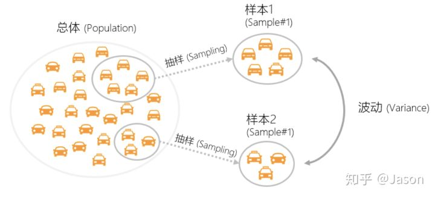
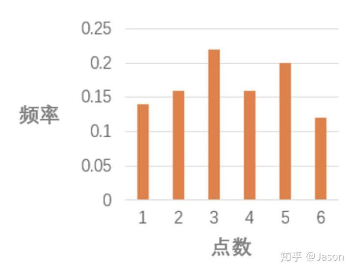
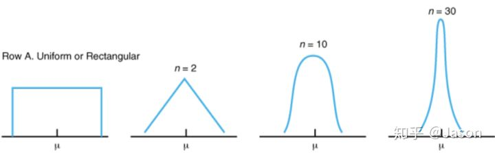

# [统计分析](Statistics/README.md)

## 统计对于A/B测试的价值

因为A/B Test从本质上来说是一个基于统计的假设检验过程。
它首先对实验组和对照组的关系提出了某种假设，然后计算这两组数据的差异和确定该差异是否存在统计上的显著性，最后根据上述结果对假设做出判断。  

事实上，我们关心的重点并不是实验组和对照组这一小部分用户，而是我们的新方案最终全量曝光给所有用户会带来多大的影响。

***统计的价值在于其先验性***
能帮助我们在事情尚未发生时通过手头有限的信息来预测和估计将来我们不了解的结果，且具有一定的准确度。

既然统计能根据有限信息一定程度上准确推测全量信息，  
那么它满足了我们同时验证多个idea的需求，让平台同时并行跑大量实验成为可能，大大提高测试效率。  

而测试效率与业务增长速度呈高度正相关，即使100个实验里有80个与预想的转化率提升无关，  
也帮助验证了100个idea，挡住了80个无效的尝试，这就是为什么统计对于A/B Test来说如此有价值的原因。

## 统计要解决的问题

例如：我想知道发5元券相比发3元券对于新用户的冒泡率是否有提升，  
针对这个例子，随机选取了10000个用户做实验，5000个用户分到「对照组-得到3元券」，5000个用户为「实验组-拿到5元券」，  
经过一周的的观察，得到对照组转化率为40%，实验组为41%。  

那么能否认为5元券起到了更好的拉新效果呢？  
如果简单粗暴来看，41% 明显优于40%，我们可以认为对于这10000个用户来说，实验组方案确实起到了更好的拉新效果。  
但需要注意的是，这10000个用户仅是这个实验中的样本，样本永远不可能是总体的完美代表，  
***用样本估计总体是有偏的***，那么这次估计可不可信，多大程度可信，这就是统计需要解决的问题。

## 概念

* 总体(Population) 

我们最终关注的全部对象。例如，  
如果我们的实验对象是10%的用户，那么它与剩下90%用户组成的全部用户是总体；  
如果我们的对象是这10%的用户产生的订单，那么全部用户产生的全部订单是总体。

* 样本(Sample) 

总体中的小部分用户，这是我们的实验对象。例如，    
如果我们的实验对象是10%的用户，那么样本就是这10%的用户；  
如果我们的对象是这10%的用户产生的订单， 那么样本就是这10%的用户产生的订单。

* 样本量(Sample Size)   

样本的总个数。例如， 
如果一个实验的核心指标是冒泡发单用户转化率(发单用户数/冒泡用户数)，  
那么这个实验的实验对象是用户，实验周期内有过冒泡的用户数是这个实验的样本量；  

如果一个实验的核心指标是冒泡发单率(发单数/冒泡数), 那么实验周期内的总冒泡数是这个实验的样本量，这里需要特别注意。

* 样本统计量  

它本身是个很宽泛的概念，可以是样本均值，可以是比率或方差，或其他通过样本计算出来的某个关系式。  
但是在A/B Test中，由于我们目标是了解实验组和对照组方案的好坏，  
样本统计量特指这两组的转化率（如发单率）的差异，用 “p1 - p2”表示 (p代表比率)，或均值指标(如平均订单数)的差异，用 “ord1 - ord2” 表示。

* 抽样 (Sampling) 

采用某种特定的方法，如随机抽取，从总体中选取一部分有代表性样本的方法。  

* 分布(Distribution) 

可以把分布想象成一个横轴为观测值，纵轴为出现频率的图，比如扔骰子只可能出现1-6这6种可能，重复扔50次筛子。  
它的分布也许如下：

* 正态分布(Normal Distribution)

又叫高斯分布。  
它的分布图是一个两头少/中间多的对称的钟形曲线。  
自然界的许多随机事件都服从这种分布，如人的身高，体重。  
实际业务中的大部分均值指标，如平均应答时长、人均发单数基本都满足这种分布。  

* 伯努利分布 (Binomial Distribution)   

只有0和1两种取值。都可以表达为是或否的问题。  
例如，抛一次硬币是正面向上吗？新出生的小孩是女孩吗？大部分率指标如发单率、应答率等都满足这种分布(一个用户只有发单或不发单两种情况)。

* 中心极限定理(Central Limit Theorem) 

***随着抽样次数增多，样本均值的抽样分布趋向于服从正态分布。***

需要注意的是，抽样次数并不是样本量，一次实验只是一次抽样，只能得到一个样本均值。  
而n次抽样会得到n个值，这些值的分布才是正态分布。  

举个例子，在下图中当抽样次数达到30次时，样本均值的分布逐渐呈一个对称的钟形曲线。

***中心极限定理是概率论的重要定理，它是接下来谈到的显著性检验的基础***

当一组数据属于正态分布，我们可以根据正态分布的概率密度函数推算出置信区间 和 p - value ，  
当一组数据不属正态分布时，我们仍然可以依据中心极限定理和正态分布的函数推导出置信区间和对应的 p - value。

* 「置信区间」和 「p - value」

理想状态中，样本能够完美的代表总体。  
例如，总体有100000个用户，有10000个用户成功转化，那么转化率为10%。  
理想状态中，抽取100个用户做实验，那么一定有10个用户转化。在这个例子中，样本的转化率10%是严格等于总体转化率10%的。

但是现实没有这么完美。现实情况下，在这100个样本中，也许只有2个人转化，也许有20个人转化。这就是样本之间的波动。  
由于样本的随机性，样本的观测值(如转化率)和总体的真实参数(如总体转化率)存在差距。这种差距能用 ***「抽样误差」*** 衡量。  

***抽样误差越大，用样本估计总体的结果就越不准确。***  
正因为抽样误差的存在，我们用样本观测值直接作为总体参数的估计值是不可取的。  
因此，直接比较实验组和对照组转化率的大小还不足以支撑一个有力的决策。  
我们需要更多的信息来描述这次抽样用样本估计总体的准确程度，「置信区间」和「p - value」正起到了这个作用。

## [置信区间 和 抽样误差](confidence-interval.md)

## [假设检验](hypothesis-testing.md)  

