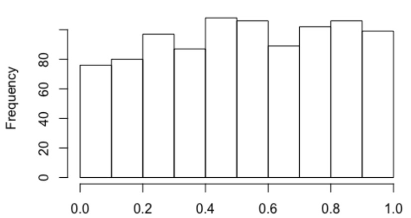

# AA实验

   * [AA实验](#aa实验)
      * [为什么进行A/A测试？](#为什么进行aa测试)
      * [假阳性](#假阳性)
      * [方差“泡沫”](#方差泡沫)
      * [计算测试持续时间](#计算测试持续时间)
      * [如何设置A/A测试？](#如何设置aa测试)
      * [运行A/A测试的成本](#运行aa测试的成本)
      * [波动性](#波动性)
         * [置信度和置信区间](#置信度和置信区间)

在 A/A Test里面, 流量同样被随机地分到两个版本里面, 只不过这两个版本都是A。  
从这个意义上来说, A/A Test可以看作是A/B Test的一个变种。   

A/A Test成功运行是A/B Test成功运行的前提。  

AA实验 通常用来辅助观察指标在产品不做改变时的偏差范围。  
通常会在实验里加一个和对照组一模一样的实验组来观察这个偏差，而如果这个偏差很大，通常你的AB实验也容易结果不置信。  

A/A测试可以理解成对两个相同版本进行的A/B测试。通常，这样做的目的是为了验证正在使用的工具运行试验在统计上是公平的。    
在A/A测试中，如果测试正确进行，控制组和实验组应该没有任何区别。

在没做A/A测试之前，你可能什么都不知道，这里的逻辑是这样的：  
如果样本的A/A测试结果达到统计显著，那么A/B测试工具或测试方案就是不可信的。

***如果说A/B测试用来测试比较几个方案的优劣，那么A/A测试就是验证A/B测试及工具置信度的有效方式。***

## 为什么进行A/A测试？

A/B Test最大的价值在于因果推断，即版本之间指标的差异可以被归因为A和B版本之间的差异。
但这只是理论上面的保证，在实践当中我们经常会遇到各种问题而做出错误的因果推断。

商业活动中，通常我们使用一切数据工具的目的，无外乎：  
用测量推动决策优化，同时用正确的决策获取比竞争对手更大的市场。    
可能通过数据能获取的决策信息点有很多，那么通过A/A测试来确保你得到的数据能用来自信地作出决定，减小决策失误。

通常情况下我们做A/A测试的目的有下面几个：
```text
1. 保证精确的流量分配
   换句话说，验证随机性实际上是通过确保每次试验产生的计数与统计范围相似
2. 识别假阳性结果的频率  
   （假阳性结果也可以理解为测试结果中的虚假繁荣，有相当的误导性）
3. 确定方差“泡沫”，帮我们更好的理解其他测试结果
```

## 假阳性

A/A测试能被用来理解假阳性结果的频率。  
简单讲，如果你在测试中采用95%置信水平，那么20次结果可能会出现1次假阳性结果。
这时候通过A/A测试，就能验证转化率的显著差异，比如，你运行20次A/A测试，其中有2次结果明显不同，这意味着假阳性的比例可能高于5%。

## 方差“泡沫”

A/A测试能帮助确定转化率中的方差“泡沫”，最小化对未来测试的影响。  
除了技术上的有效性，A/A测试能让“泡沫”在可接受范围内。

比如，如果A/A测试中的泡沫是0.1%，测试转化率是3%，那么你可以接受的范围就是2.9%-3.1%。  
如果你看到0.1%的提升，那么你就知道这样的结果是没有意义的。

A/A测试的时候，你不知道什么时候新变量和默认变量的转化率差别结果能达到统计显著。  
因此，A/A测试中的任何错误或置信度不应被用来作为未来测试的基准，因为A/A测试中本不应有转化率的明显差异。

需要注意的是，有可能只是因为随机性，导致A/A测试的两个试验结果有所不同，而不是工具或测试方案本身的问题。  
当然，随着样本量的增大，这种差别会逐渐降低。  
这是因为，小样本下的结果是不可信的，小样本从总体上意味着可能存在分配不均的数据段

## 计算测试持续时间

测试持续时间是两个因素的函数：
```text
达到一个可接受的样本大小所需的时间
变量之间的不同表现差异大小
```

如果一个变量引起了50%的变化，测试就不必运行很长时间。这种情况，即使是在小样本下，也可以忽略统计误差。

## 如何设置A/A测试？

A/A测试好在不必做任何创造性的或研发上的工作。  

A/A测试面临的挑战是正确的选择运行测试的页面，通常做A/A测试的页面都应该有两个特点：
```text
相对较高的流量。网页流量越多，越早看到变量的对比。
访客可以从页面购买或注册。我们希望根据最终目标来校验我们的A/B测试工具。
```

出于这些原因，通常我们会在网站主页上运行A/A测试。

## 运行A/A测试的成本

运行A/A测试的唯一成本：机会成本。  
有的人宁愿把A/A测试上投入的时间和流量用来多做几次A/B测试也不是没有道理的。

应该考虑运行A/A测试的唯一种情况：
```text
1.你刚安装了一个新的测试工具或更改了测试工具设置。
2.你发现了A/B测试与数据分析工具结果之间存在差异。
```

## 假设检验

参考 统计分析章节。

### AA判断
判断A/A Test是否有问题就是看第一类错误，因为在A/A Test里面$H0$总是对的。  

具体的做法是看观察到的第一类错误的概率和设定的阈值是否一致。  
比如我们设定的阈值是0.05，那么观察到的第一类错误的概率应该和0.05非常接近。  

既然是看第一类错误的概率，A/A Test的数量就不能太少，否则统计上面就不可靠。  
因为第一类错误不依赖于样本量，所以我们通常可以同时运行很多个A/A Test的版本来获得足够多的独立的A/A Test的结果。  
事实上，判断A/A Test更加全面的方法是看A/A Test中版本之间均值对比产生的$p$值是否服从0到1上面的均匀分布。  

## 波动性
实验开启一段时间之后看产出的实验指标Read/U（平均每个用户每天会有多少次阅读），  
虽然分配到两个组的用户使用的是完全一样的产品，但是两个组汇总到的 Read/U 均值总是有多多少少的差别。  
如果你重复开这个实验很多次，你会发现每次两个组上的差别都不太一样。

这种出现在AA实验上的不稳定的指标差，就是我们说的波动。

产生波动的原因很好理解，一句话来说就是“随机性”。  
下一秒打开头条的那个用户今天会读几篇文章这完全是随机的，不可预知的。
所以当你开两个完全相同的实验组的时候，因为每个组里的用户今天会读的文章数完全随机，所以最终我们拿到的两个 Read/U 指标的差别也是随机的。

### 置信度和置信区间

你做无数多次AA实验，指标的差落在某个范围内（置信区间）的概率有多大（置信度）

假如我们知道头条主App的 Read/U 指标，200W入组用户的AA实验在置信度为95%的时候上下波动0.62%，
说明大概率下，我们做一个AA实验，Read/U 指标的变化比例会在正负0.62%以内。

如果你做的AB实验预期 Read/U 会上升 1%，那么恭喜你，做实验验证去吧；  
如果你做的AB实验预期 Read/U 会上升 0.1%，那么不好意思，这个变化太不明显了，  
假如最终实验结果真的上升了0.1%，我们很难判断这是策略生效导致的还是波动导致的。  

## 案例

* 怎么判断A/A Test是否成功运行？   

配了20个实验版本，实验一共运行了5天。  
对于一个给定的指标，20个实验版本之间两两比较每天可以产生10个独立的$p$值。  

每一天都会用新进入实验的用户来对这20个版本进行指标的比较从而保证跨天的$p$值的独立性，这样5天一共产生了50个独立的$p$值。  
如前面所说, 我们判断A/A Test是否成功运行的标准就是看这些值是否服从0到1上面的均匀分布。  

  

上面的直方图与均匀分布的直方图非常接近。注意只有50个样本，所以多少会有一些波动的。  
直方图直观易懂，但是不太严格。在直方图的基础上还可以进行严格的假设检验来判断$p$值是否服从均匀分布。  

这个假设检验的原假设就是$p$值是服从均匀分布的，如果假设检验出来的$p$值(注意这是$p$值分布假设检验的$p$值，两个$p$值不是同一个东西)很小。  
我们就拒绝这个原假设，认为$p$值不服从均匀分布。  

## 总结

根据经验，A/A Test经常发现的问题是数据方面的问题， 工程方面比如分流的问题比较少见。  

* $T$ 统计量服从标准正态分布与$p$值服从 $U\{0,1\}$ 分布的等价性
这样就说明了我们可以通过看$p$值是否服从 $U\{0,1\}$ 来判断A/A Test是否成功运行。

* $T$ 统计量分布与标准正态的偏差比发现对应的$p$值分布与$U{0,1\}$ 的偏差更容易
* *  那么怎么量化这个比较呢?
通过假设检验的方法来做。  
对于$T$ 统计量，$H_0$是它服从标准正态分布， $H1$是它不服从标准正态分布。
对于$p$值，$H_0$是它服从均匀分布，$H1$是它不服从均匀分布。  

$T$ 统计量不服从标准正态分布或者$p$值不服从均匀分布意味着$H1$是对的。  
因此我们希望拒绝$H_0$。在$H_1$是对的情况下拒绝$H_0$的概率就是统计功效。统计功效越大越好。  

## 建议

在新场景下面运行A/B Test之前最好能进行A/A Test，  
此外实验系统，埋点和数据回流，以及指标计算都是动态变化的，因此A/A Test应该持续的运行。  

AA Test的意义还是很大的，应该内含在AB Test之下，不需要被人感知。