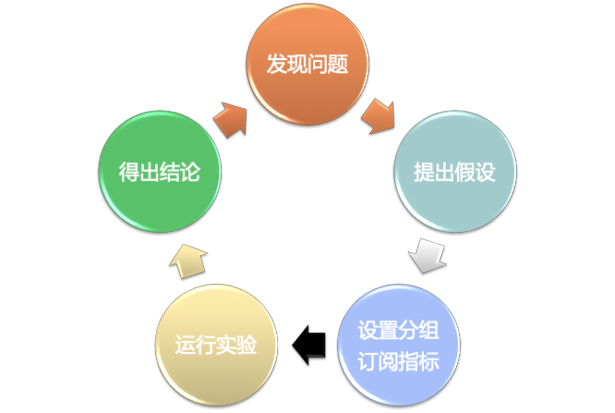

# AB 实验原理

## 前提

* 同一时间维度（同时性）
时间的统一性有效的规避了因为时间、季节等因素带来的影响

* 相似属性分组用户（同质性）
两个策略对应的使用群体需要保证尽量一致。
属性的相似性则使得地域、性别、年龄等等其他因素对效果统计的影响降至最低。

## 不适用
尽管A/B Test可以弥补产品优化中遇到的不足，但它并不完全适用于所有的产品。
因为A/B Test的结果需要大量数据支撑，日流量越大的网站得出结果越准确。
通常来说，我们建议在进行A/B Test时，能够保证 ***实验分组的DAU至少10000以上*** ，否则实验周期将会很长，或很难获得准确的数据结果。

## 场景

### UI及交互
UI展示：“9.9元包邮”和“白菜价”哪个CTR高。
交互逻辑：“搜索功能应该在左侧还是右侧”
### 产品功能
产品方案：商品列表每屏展示一列还是两列能提高成交。
发版上线：小流量验证，效果正向的话再全量。

### 运营活动
给用户发1张100元红包还是发10个10元红包好。

### 策略算法
基于内容的推荐算法（根据用户的历史记录推荐相似内容）、
基于协同过滤的推荐算法（根据有相似兴趣用户的行为推荐相关内容）、
基于关联规则的推荐算法（根据内容本身的相关性给用户推荐），通过不同的算法进行A/B Test,r找到提高用户使用黏性的最佳方案。

“如何证明千人千面的策略优于热门推荐”

## 流程

### 发现问题
分析现有版本的各项数据指标，如购买转化率等，比如当前购买转化率仅有1%，根据当前的数据分析、竞品调研、KPI或其它多项对比，发现购买转化率比较低。

### 提出假设
在发现了问题以及确定了要优化的目标后，便可以开始对当前版本提出优化的想法和假设。  
如：针对购买转化率比较低，假设优化商品详情页或是购买流程等可以提升购买转化率，并将假设实施到产品方案中；  
限于团队资源有限，无法把所有的想法全部去验证，这就需要根据优先极排期，选择最重要的改进方案去做A/B Test。  

***在做A/B实验时可以大胆假设，小心求证。***  

### 实验设计（设置分组+订阅指标）
提出假设并确定了优化的方案后，可以针对要做A/B Test的方案进行实验设计；  
通常一个实验至少设置两个实验分组，一个是对照组（即线上旧方案），一个是实验组（即新方案），可以根据实际情况设置多个实验组；  
在此需要注意的是：***每个分组需要保证只有一个变量。***

在设置好实验分组后就要订阅这次实验关注的指标了，建议一个实验至少包含1-5个核心指标和若干个辅助指标；  
并且核心指标中除了要关注正向指标，同时也要负向指标；  
如做一个发push 和不发push的实验，除了在关注对【购买转化率】这个正向指标外，还要关注一下【APP卸载率】相关的负向指标。  
一个实验并不是关注的指标越多越好，但是必须要有能够决策这个实验结果的指标。  

### 运行实验
实验分组设置和订阅指标完毕后，实验可以发布并运行上线了；实验上线后可以实时关注数据，并根据数据调整实验流量。  

### 得出结论
实验运行一段时间后，就可以根据实验数据以分析结果了；  
A/B test分析将显示两个版本之间是否存在统计性显著差异，所以在分析结论时不止要观注实验分组之前的差异性，  
还要关注置信度和置信区间等统计指标来检测差异的真实性及可信度。